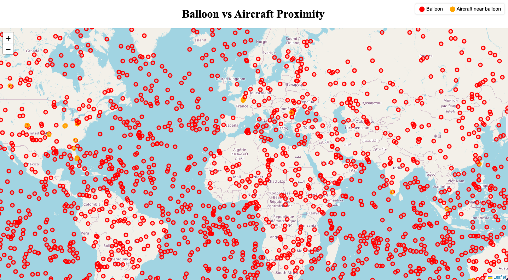

# Balloon vs Aircraft Proximity

A live, interactive map that visualizes the proximity between high-altitude balloons and nearby aircraft using real-time data.



---

## Live Demo

🔗 [View the deployed project](https://balloon-visualizer.vercel.app)

---

## Data Sources

### 1. Windborne Constellation API  
We use [Windborne Systems](https://a.windbornesystems.com/treasure/00.json) balloon data to show global sounding balloon positions.  
- `/00.json` = current hour  
- `/01.json` through `/23.json` = hourly historical data  
- The app fetches up to **24 hours of balloon history** (00–23).

### 2. OpenSky Network API  
The [OpenSky Network](https://opensky-network.org/api/states/all) provides live aircraft telemetry:  
- Position, altitude, and call sign of commercial aircraft  
- Used to detect when a plane is **within 50 km and 1000 m vertical** of any balloon

---

## Features

- Interactive Leaflet.js map  
- Real-time balloon and aircraft positions  
-  Collision proximity detection  
-  Tooltips showing position & ID  
-  Color-coded markers:  
    - 🟥 Red = Balloon  
    - 🟧 Orange = Aircraft near balloon  
- Custom legend

---

##  Insights

This project highlights how high-altitude balloons could potentially interfere with aircraft in real airspace. By combining balloon telemetry and global flight data, it visualizes potential **safety overlaps** and encourages better tracking and coordination of airborne experiments.

---

## Tech Stack

- **JavaScript**
- **Leaflet.js** for maps
- **Vercel** for deployment
- **GitHub** for version control

---

## Notes

- Windborne's balloon API is undocumented, and some files may be missing or corrupted. We added error handling to skip failed fetches.
- We chose OpenSky Network because it’s a **free, open, real-time API** with excellent coverage of commercial aircraft.

---


---

##  Setup & Run Locally

```bash
git clone https://github.com/AniaNiedzialek/balloon-visualizer
cd balloon-visualizer
# Open index.html in browser
# Or deploy via Vercel with one click.
```

---
##  Contact
Created by Anna Niedzialek - CS @ SJSU
Project for Windborne Engineering Challenge

